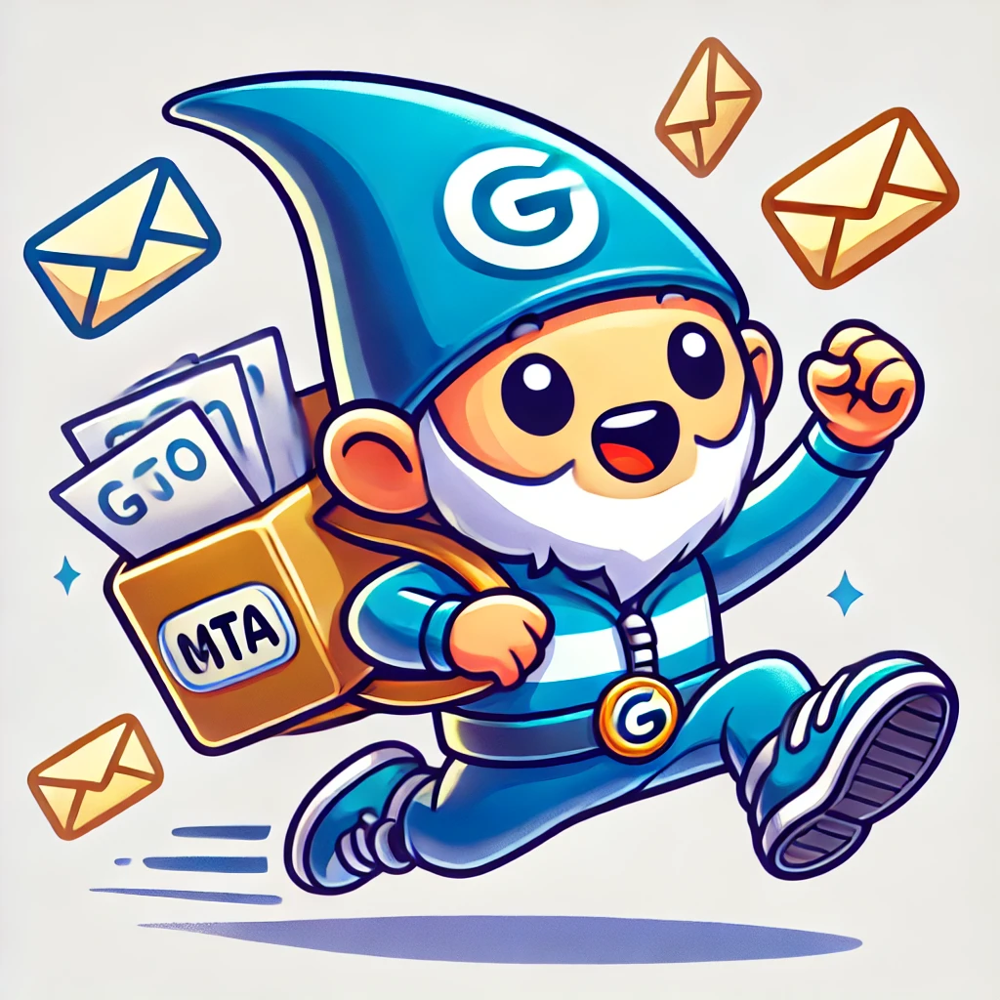

# GoMTA - A Fast and Reliable Mail Transport Agent



## Introduction

**GoMTA** is a lightweight, fast, and secure Mail Transport Agent (MTA) built in the **Go** programming language.
Designed to handle email delivery with speed and reliability, GoMTA is perfect for small servers, internal mail systems, and anyone needing a modern MTA solution.

Meet **Gno-Go**, our lovable mascot who embodies the speed and agility of GoMTA.
Gno-Go is always on the run, ensuring your mail gets delivered swiftly and reliably!

## Features

- **Built for Speed**: Optimized for fast and efficient mail delivery.
- **Lightweight**: Minimal resource usage, making it ideal for small or resource-constrained environments.
- **Secure**: Includes modern security features and configurations to ensure safe mail transfer.
- **Written in Go**: Harness the power and concurrency of Go for seamless performance.
- **Easy Setup**: Simple installation and configuration for getting your mail server running quickly.

## Installation

To install GoMTA, follow these steps:

1. **Clone the repository**:
    ```bash
    git clone https://github.com/yourusername/gomta.git
    cd gomta
    ```

2. **Build the project**:
    ```bash
    go build .
    ```

3. **Configure**:
   Edit the configuration file located in `config/gomta.conf` to suit your environment.

4. **Run GoMTA**:
    ```bash
    ./gomta
    ```

## Usage

GoMTA is easy to configure and run.
Here’s a quick example of how to set up a basic MTA configuration:

```yaml
# config/gomta.conf
server:
  host: smtp.example.com
  port: 587
  tls: true
  username: your-email@example.com
  password: your-secure-password
```

## Gno-Go, Our Mascot

**Gno-Go** represents the swift and reliable nature of GoMTA.
With a mailbag in hand and always running, Gno-Go symbolizes the core principles of the project: **speed, efficiency, and reliability**.
Keep an eye on him as he delivers your mail with a smile!

## Contributing

We welcome contributions from the community! Feel free to open issues, submit pull requests, or suggest features.

1. Fork the project
2. Create your feature branch (`git checkout -b feature/awesome-feature`)
3. Commit your changes (`git commit -m 'Add some awesome feature'`)
4. Push to the branch (`git push origin feature/awesome-feature`)
5. Open a pull request

## License

GoMTA is licensed under the **MIT License**.
See the [LICENSE](LICENSE) file for more details.
